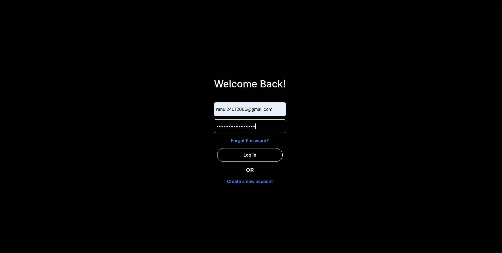
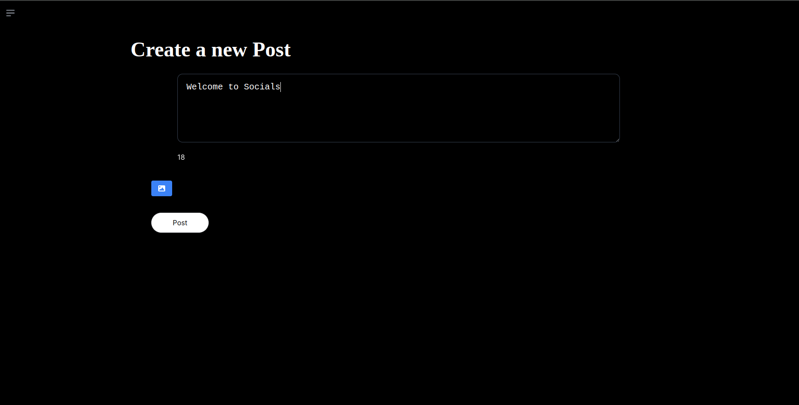
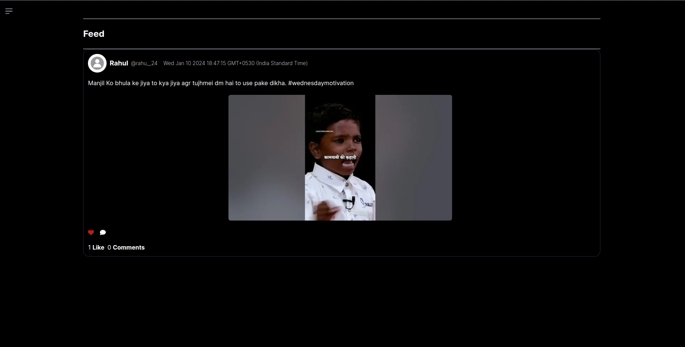
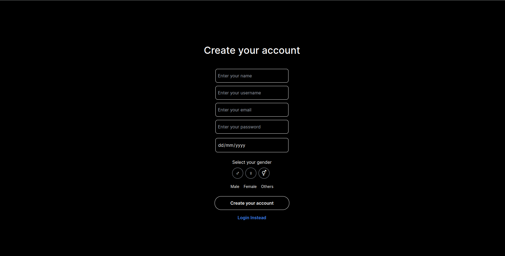
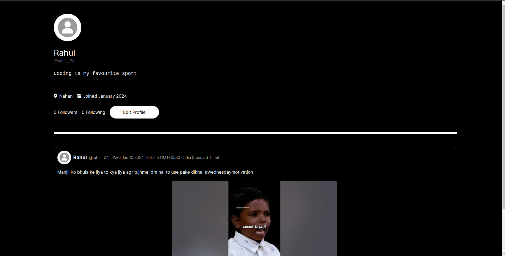

## `Socials` A Social Media Application created using Tailwind, Typescript and Next Js

### Features Added till now

1. Login/Signup
2. Follow and Unfollow Users
3. Edit Your Profile
4. Post your pictures with catchy captions
5. Add or remove users from your followers list
6. Comment and like posts of users
7. Visit to other users profile

### Guide to set it up locally

1. Open terminal in root folder and run `npm install` to install the dependencies

2. Run `npm run dev` and it will get started in port number 3000

3. Application will be opened in your browser now 💻

**Always add environment variables in root folder**

### Screenshot of #socials

## Author's Social Links 🖥️

- [Twitter](https://twitter.com/rahu__24)
- [LinkedIn](https://www.linkedin.com/in/rahu24/)
- [Instagram](https://www.instagram.com/rahu__24/)
